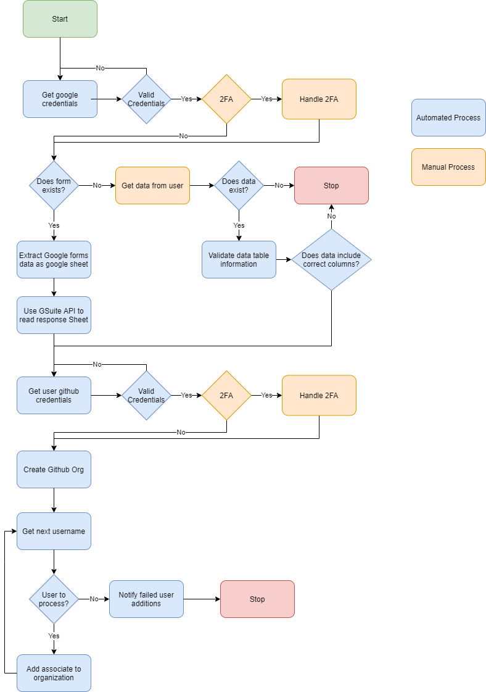

# GitHub Organization Automation

### Project Overview

This project is a UiPath implemented automation that creates a GitHub organization for a new batch of associates at Revature. This automation ensures that this process is handled efficiently and accurately.

#### FlowChart



### Technologies Used

- UiPath Studio 2020.10.2
- UiPath Assistant
- UiPath Orchestrator

### Functionalities

- Creates a new GitHub organization for a new Batch of associates
- Uses preexisting Google Form responses to add members to the new organization

### Getting Started

In order to run project you will need the following environment(s):

- UiPath Robot or Assistant
- UiPath Orchestrator
- Microsoft Edge

#### Microsoft Edge Setup

- Make sure you have the UiPath Web automation extension enabled on your Microsoft Edge browser.
- To do this simply navigate to the extensions page on Edge, click 'Get extensions for Microsoft Edge'
- This will allow the automation to interact with the Edge browser
- Enable popups on Microsoft edge

#### Local Setup

Run the following git command to download the project locally:

```
git clone https://github.com/UiPath-Project3-1/uipath-automation-2.git
```

For a fully unattended automation add a file at the following path:

```
~\Documents\RevatureAutomationFiles\BatchOrganization.txt
```

The file should contain the following information:

```
{
    "BatchName": "BatchName-111",
    "ContactEmail": "contactemail@gmail.com",
    "OrganizationBusiness": ""
}
```

- this file is automatically generated if it does not exist on your machine via an attended form during the process execution

- the **BatchName** and **ContactEmail** are required

#### Orchestrator Setup

Connect machine to Orchestrator. _For further instructions see documentation link:_

- https://docs.uipath.com/orchestrator/docs/managing-robots-modern-folders.

_(optional)_ In Orchestrator create an asset **'GoogleCredential'** and update with google account username and password

_(optional)_ In Orchestrator create an asset **'GithubCredential'** and update with github username and password. _For further instructions see documentation link:_

- https://docs.uipath.com/orchestrator/docs/managing-assets-in-studio

### Usage
